# AS-Import-AD-Group-Users-to-MS-Watchlist

Author: Accelerynt

For any technical questions, please contact info@accelerynt.com  

       

This playbook is intended to be run on a schedule. It will add the users from a specified Azure Active Directory group to a Microsoft Sentinel watchlist.

#
### Requirements

The following items are required under the template settings during deployment: 

* An [Azure Active Directory group Id](https://github.com/Accelerynt-Security/AS-Import-AD-Group-Users-to-MS-Watchlist#azure-active-directory-group-id)

* A [Microsoft Sentinel Workspace name](https://github.com/Accelerynt-Security/AS-Import-AD-Group-Users-to-MS-Watchlist#microsoft-sentinel-workspace-name)

# 
### Setup

#### Azure Active Directory Group Id:

Navigate to the Azure Active Directory Groups page: 
https://portal.azure.com/#view/Microsoft_AAD_IAM/GroupsManagementMenuBlade/~/AllGroups

Create a new group, or locate the existing group you would like to use with this playbook and click the name.

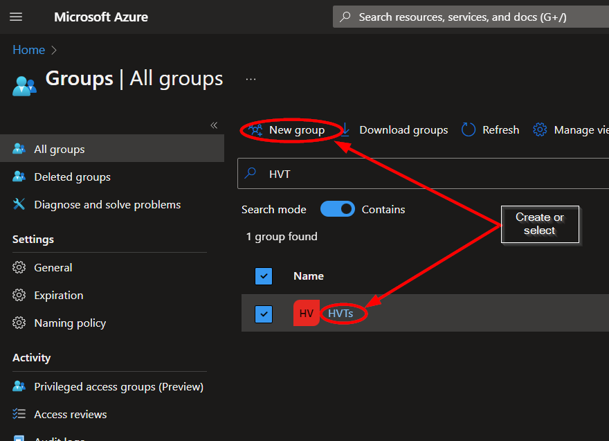

From the group "**Overview**" page, copy the value of the "**Object Id**" and save it for deployment.

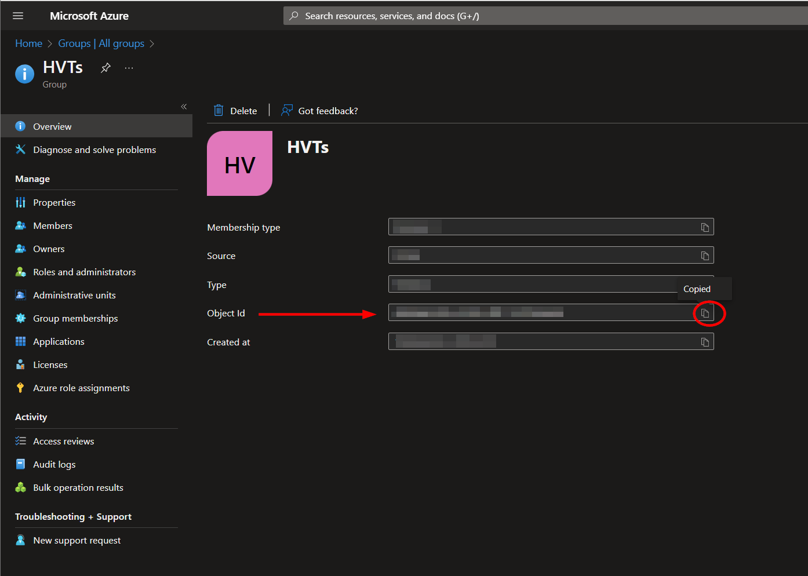

#### Microsoft Sentinel Workspace Name:

Navigate to the Microsoft Sentinel page and select a workspace:

https://portal.azure.com/#view/HubsExtension/BrowseResource/resourceType/microsoft.securityinsightsarg%2Fsentinel

Under the "**Configuration**" section of the menu, click "**Watchlist**", then click "**Add new**".

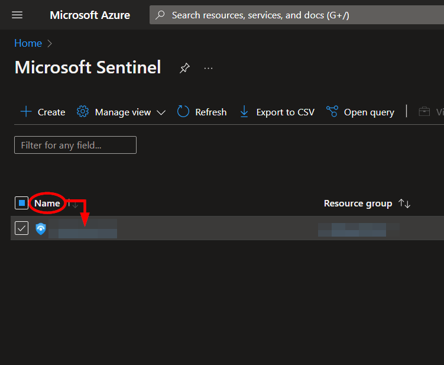

Fill out the required fields, and take note of the value you use for "**Alias**" as this will be needed for deployment. Then click "**Next: Source**".

The watchlist cannot be created without initial data. We have created a file with the necessary headers and an entry that can later be deleted from the watchlist once it has been updated with additional entries.

Upload the "**watchlist_initialize.csv**" included in this repository and select "**id**" as the search key. Then click "**Next: Review and create**".

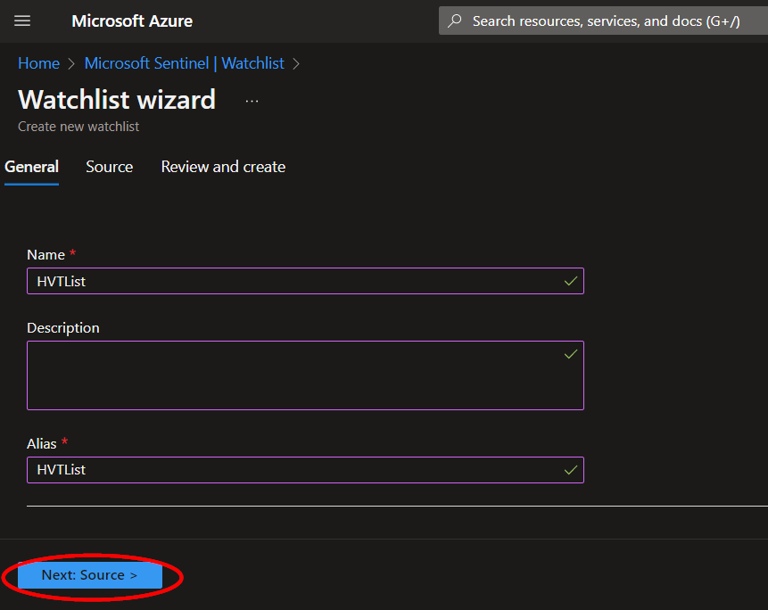

Review the information, then click "**Create**".
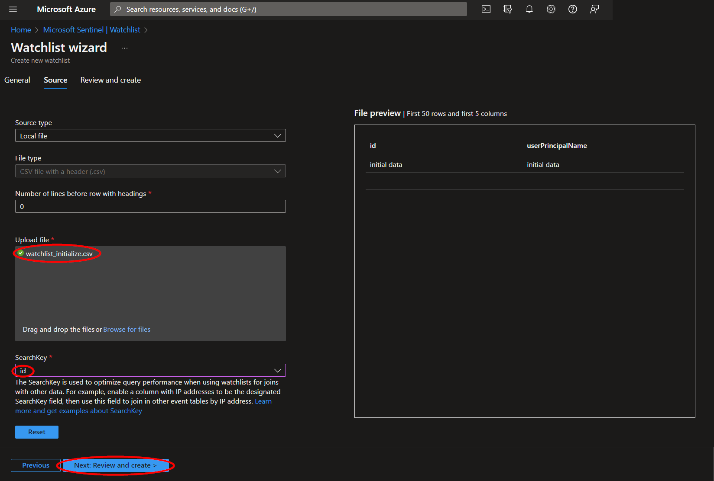

Once your watchlist has been created, you can view the entries by clicking the watchlist name from the "**Overview**" page, and then clicking "**View in logs**".

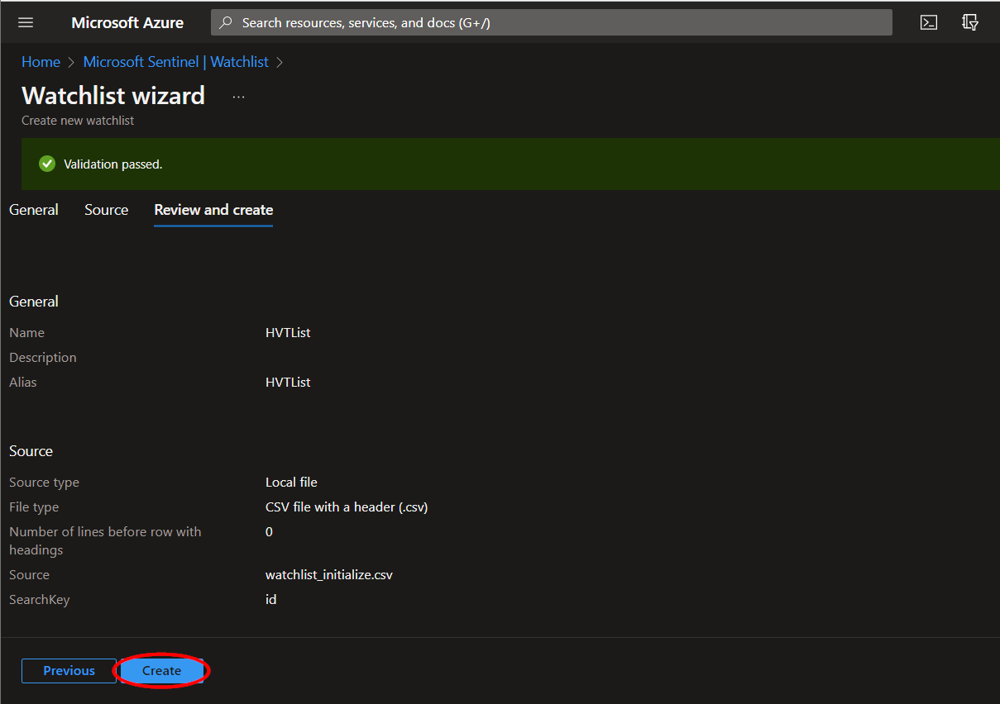

This will run a Kusto query for your watchlist and you should be able to see the initializing data that was just uploaded. Please note it may take a minute after the creation of your watchlist for the query to show results.

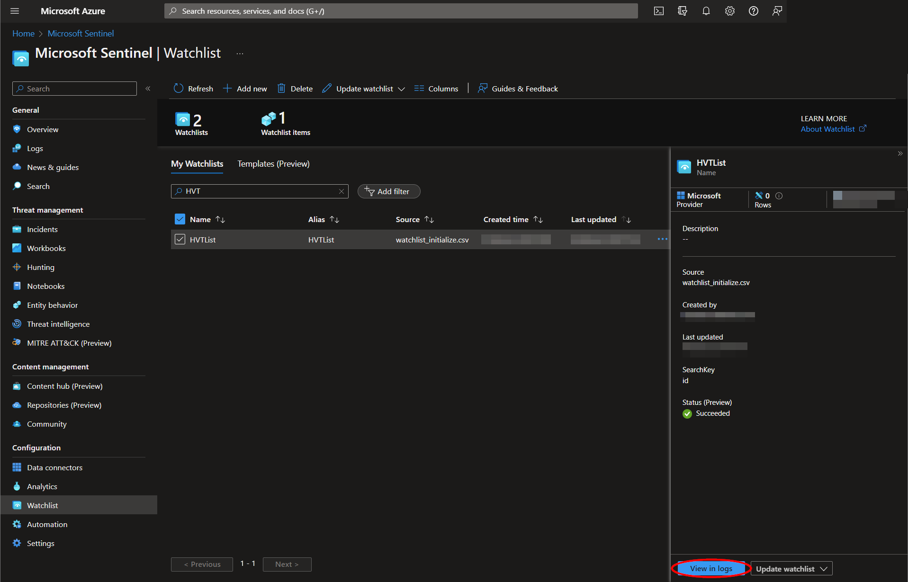

#
### Deployment                                                                                                         
                                                                                                        
To configure and deploy this playbook:
 
Open your browser and ensure you are logged into your Microsoft Sentinel workspace. In a separate tab, open the link to our playbook on the Accelerynt Security GitHub Repository:

https://github.com/Accelerynt-Security/AS-Import-AD-Group-Users-to-MS-Watchlist

                                             

Click the “**Deploy to Azure**” button at the bottom and it will bring you to the custom deployment template.

In the **Project Details** section:

* Select the “**Subscription**” and “**Resource Group**” from the dropdown boxes you would like the playbook deployed to.  

In the **Instance Details** section:   

* **Playbook Name**: This can be left as "**AS-Import-AD-Group-Users-to-MS-Watchlist**" or you may change it.  

* **Group Id**: Enter the Id of the Azure Active Directory group referenced in [Azure Active Directory group Id](https://github.com/Accelerynt-Security/AS-Import-AD-Group-Users-to-MS-Watchlist#azure-active-directory-group-id).

* **Watchlist Name**: The name of the watchlist to be created. This can be left as "**HighValueTargetList**" or you may change it.

* **Watchlist Description**: The optional description of the watchlist to be created. This can be left as is, or you may change it.

* **Workspace Name**: The name of the Microsoft Sentinel workspace referenced in [Microsoft Sentinel Workspace name](https://github.com/Accelerynt-Security/AS-Import-AD-Group-Users-to-MS-Watchlist#microsoft-sentinel-workspace-name)

Towards the bottom, click on “**Review + create**”. 

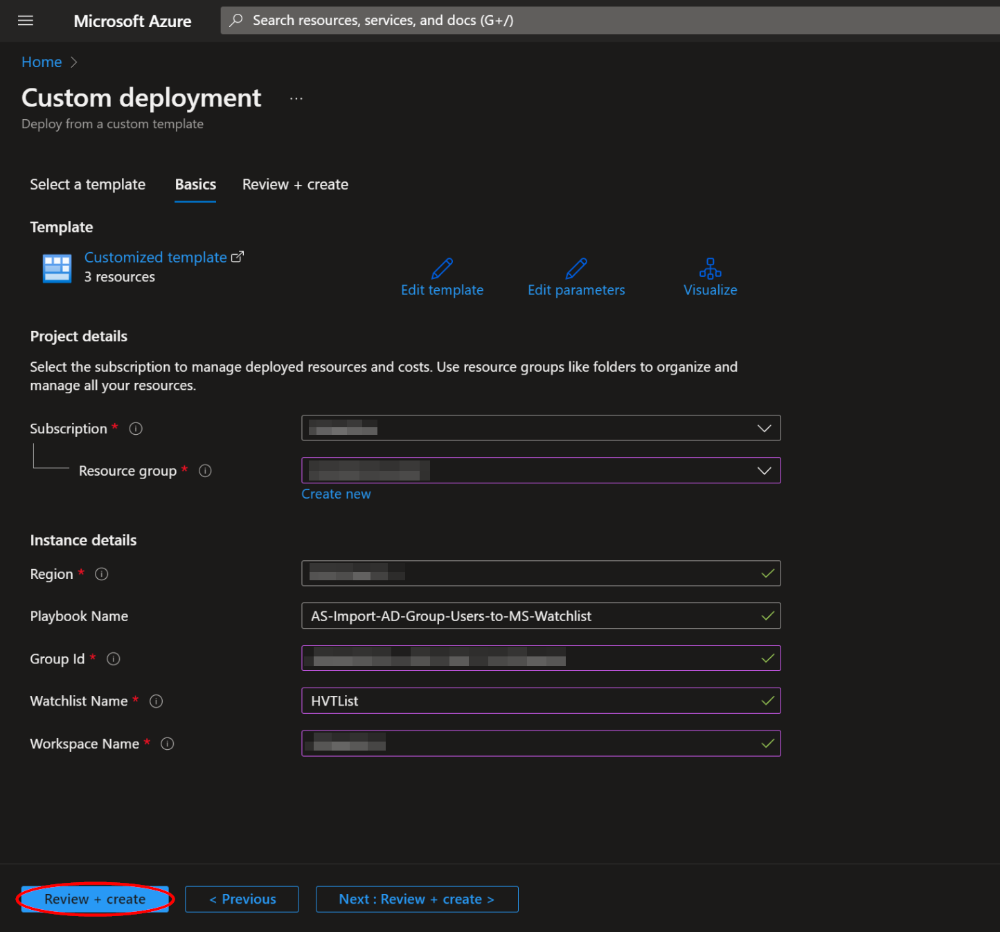

Once the resources have validated, click on "**Create**".

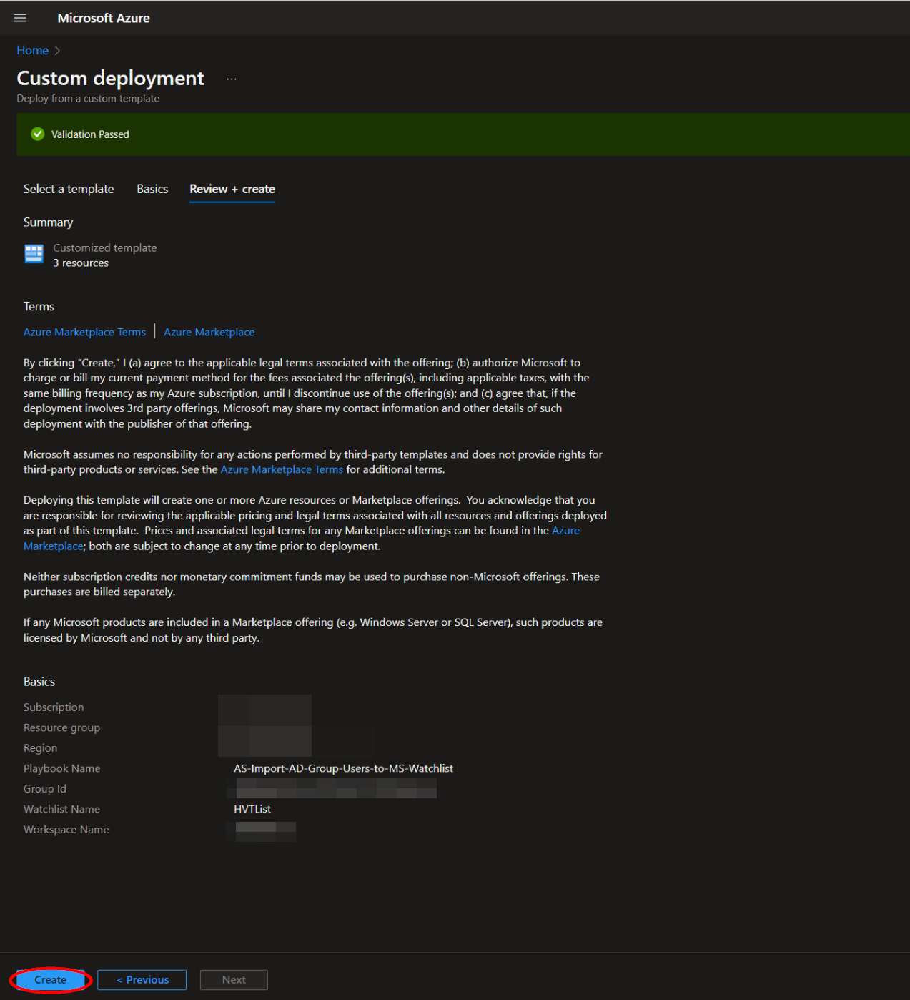

The resources should take around a minute to deploy. Once the deployment is complete, you can expand the "**Deployment details**" section to view them.
Click the one corresponding to the Logic App.

Click on the “**Edit**” button. This will bring us into the Logic Apps Designer.

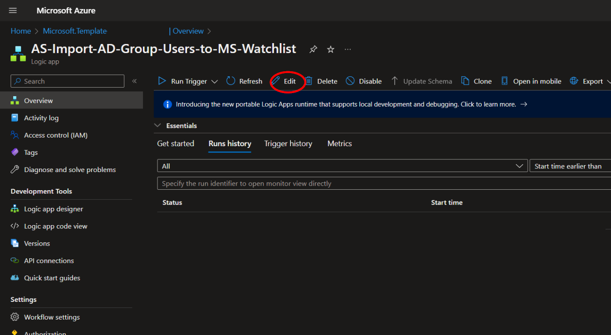

Before the playbook can be run, the Azure AD connection used in the second step will either need to be authorized, or an existing authorized connection may be alternatively selected.  

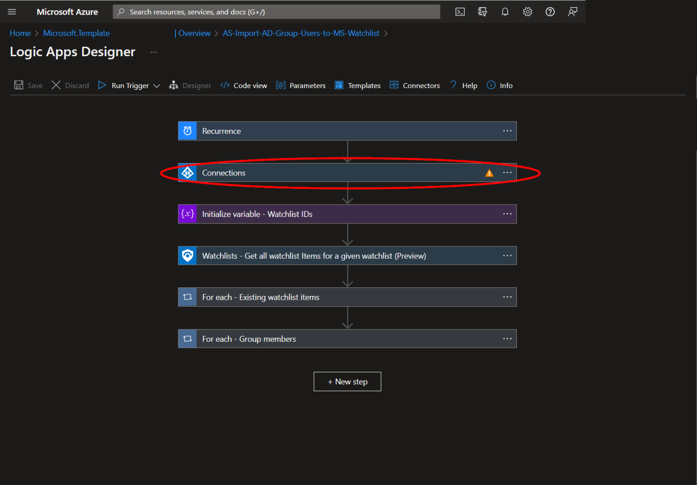

To validate this connection, expand the second step labeled "**Connections**" and click the exclamation point icon next to the name matching the playbook.
                                                                                                
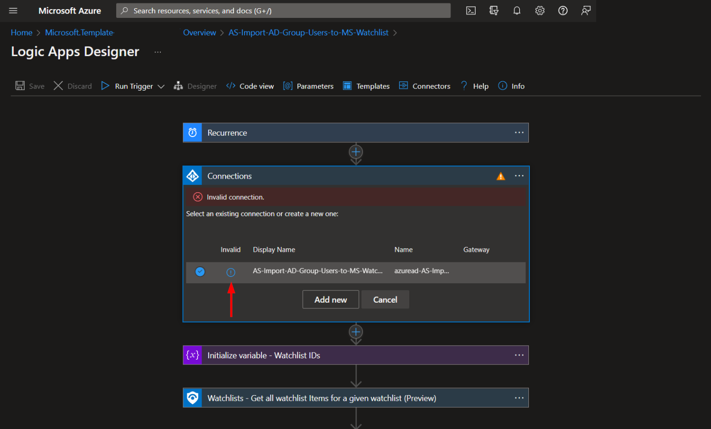

When prompted, sign in to validate the connection.                                                                                                
                                                                                                
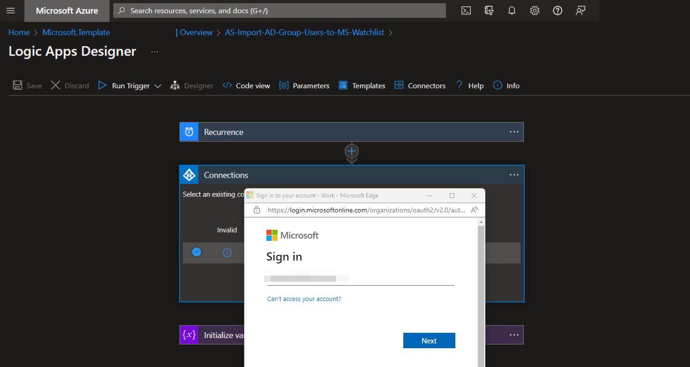
