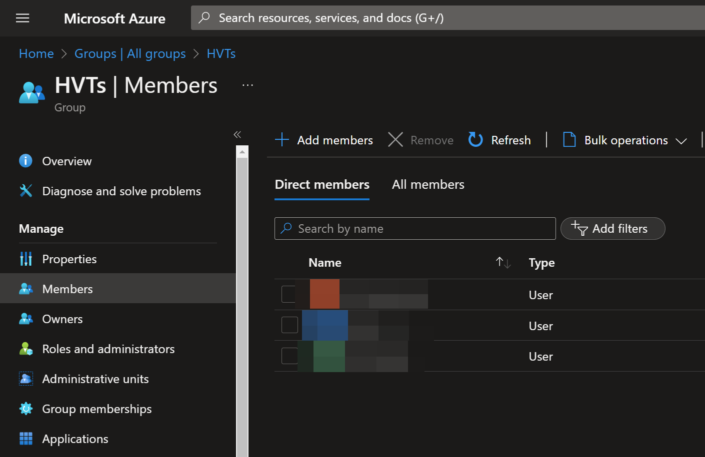
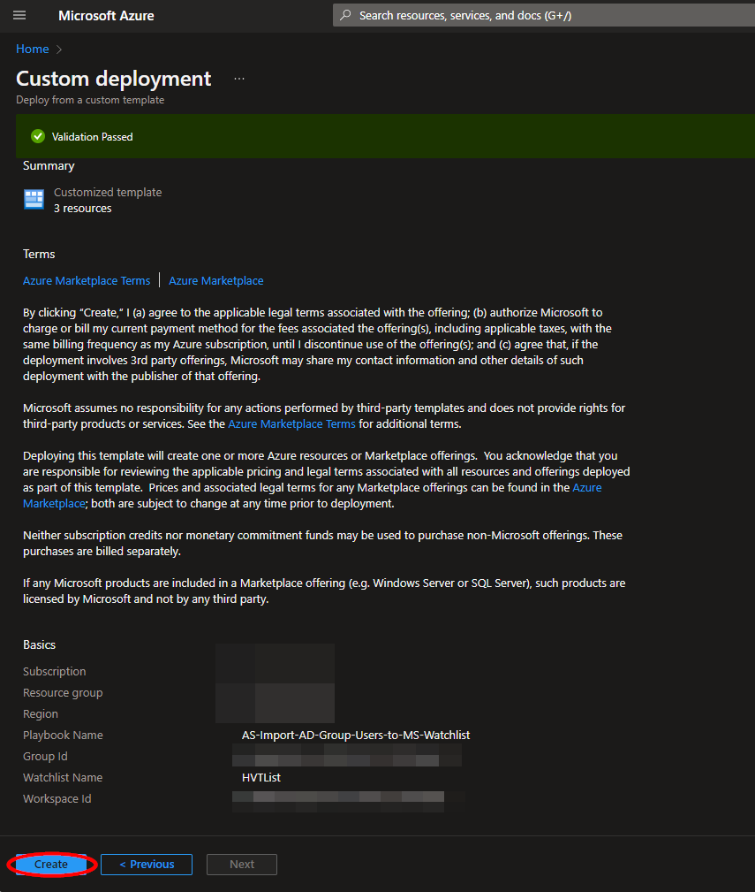
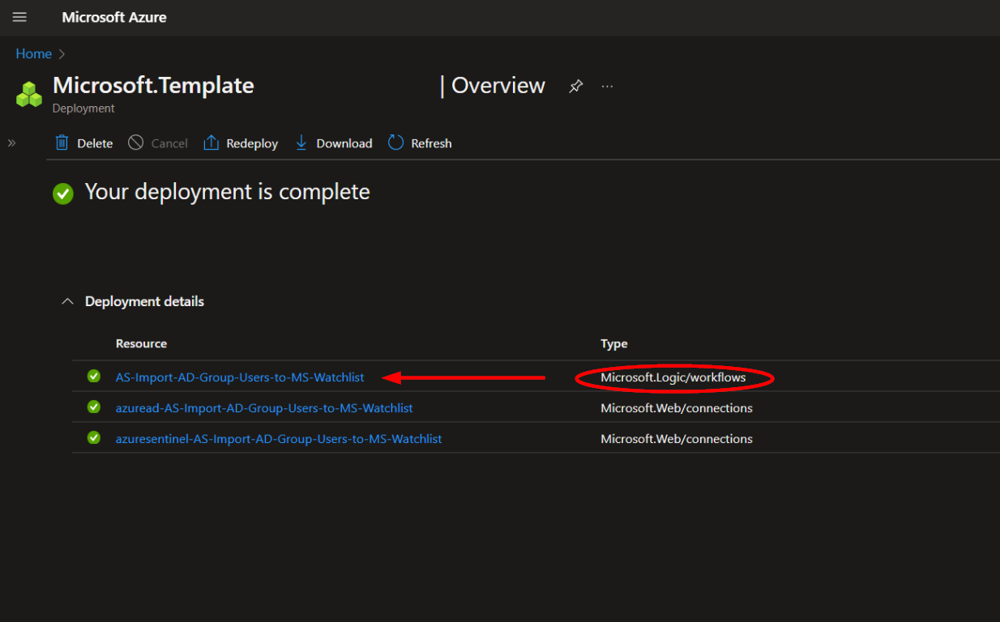
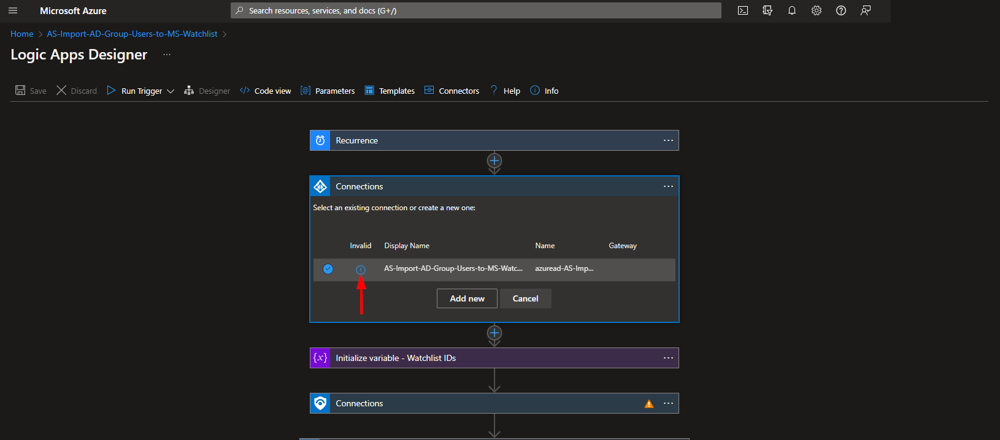
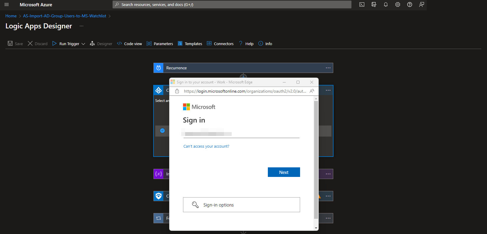
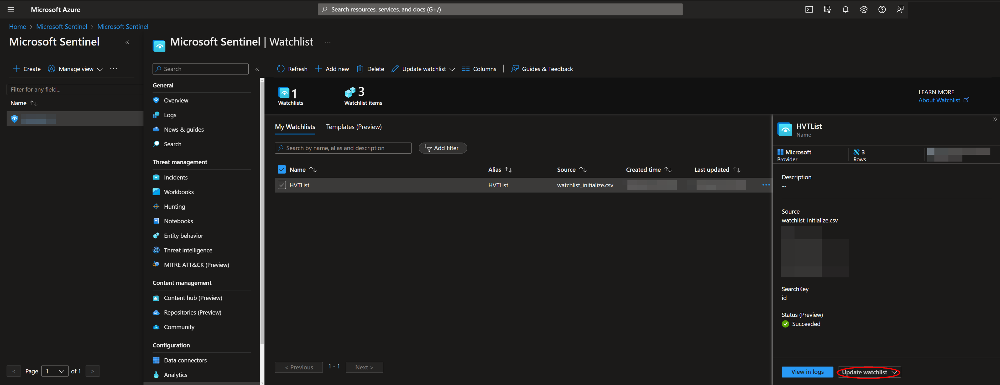

# AS-Import-AD-Group-Users-to-MS-Watchlist

Author: Accelerynt

For any technical questions, please contact info@accelerynt.com  

       

This playbook is intended to be run on a schedule. It will add the users from a specified Azure Active Directory group to a Microsoft Sentinel watchlist.

#
### Requirements

The following items are required under the template settings during deployment: 

* An [Azure Active Directory group Id](https://github.com/Accelerynt-Security/AS-Import-AD-Group-Users-to-MS-Watchlist#azure-active-directory-group-id)

* A [Microsoft Sentinel Workspace name](https://github.com/Accelerynt-Security/AS-Import-AD-Group-Users-to-MS-Watchlist#microsoft-sentinel-workspace-name)

# 
### Setup

#### Azure Active Directory Group Id:

Navigate to the Azure Active Directory Groups page: 
https://portal.azure.com/#view/Microsoft_AAD_IAM/GroupsManagementMenuBlade/~/AllGroups

Create a new group or locate the existing group you would like to use with this playbook and click the name.

From the group "**Overview**" page, copy the value of the "**Object Id**" and save it for deployment.

#### Microsoft Sentinel Workspace Name:

This playbook will create a Microsoft Sentinel watchlist during deployment. You will need to specify which Microsoft Sentinel workspace you would like to use. 

Navigate to the Microsoft Sentinel page and select a workspace:

https://portal.azure.com/#view/HubsExtension/BrowseResource/resourceType/microsoft.securityinsightsarg%2Fsentinel

Copy the name of the Microsoft Sentinel workspace and save it for deployment.

#
### Deployment                                                                                                         
                                                                                                        
To configure and deploy this playbook:
 
Open your browser and ensure you are logged into the same Microsoft Sentinel workspace selected above. In a separate tab, open the link to our playbook on the Accelerynt Security GitHub Repository:

https://github.com/Accelerynt-Security/AS-Import-AD-Group-Users-to-MS-Watchlist

                                             

Click the “**Deploy to Azure**” button at the bottom and it will bring you to the custom deployment template.

In the **Project Details** section:

* Select the “**Subscription**” and “**Resource Group**” from the dropdown boxes you would like the playbook deployed to.  

In the **Instance Details** section:   

* **Playbook Name**: This can be left as "**AS-Import-AD-Group-Users-to-MS-Watchlist**" or you may change it.  

* **Group Id**: Enter the Id of the Azure Active Directory group referenced in [Azure Active Directory group Id](https://github.com/Accelerynt-Security/AS-Import-AD-Group-Users-to-MS-Watchlist#azure-active-directory-group-id).

* **Watchlist Name**: The name of the watchlist to be created. This can be left as "**HighValueTargetList**" or you may change it.

* **Watchlist Description**: The optional description of the watchlist to be created. This can be left as is, or you may change it.

* **Workspace Name**: The name of the Microsoft Sentinel workspace referenced in [Microsoft Sentinel Workspace name](https://github.com/Accelerynt-Security/AS-Import-AD-Group-Users-to-MS-Watchlist#microsoft-sentinel-workspace-name)

Towards the bottom, click on “**Review + create**”. 

Once the resources have validated, click on "**Create**".

The resources should take around a minute to deploy. Once the deployment is complete, you can expand the "**Deployment details**" section to view them.
Click the one corresponding to the Logic App.

Click on the “**Edit**” button. This will bring us into the Logic Apps Designer.

Before the playbook can be run, the Azure AD connection used in the second step will either need to be authorized, or an existing authorized connection may be alternatively selected.  

To validate this connection, expand the second step labeled "**Connections**" and click the exclamation point icon next to the name matching the playbook.
                                                                                                

When prompted, sign in to validate the connection.                                                                                                
                                                                                                

# 
### Viewing and Editing the Microsoft Sentinel Watchlist

After deployment, you can find your watchlist by returning to the Microsoft Sentinel page:

https://portal.azure.com/#view/HubsExtension/BrowseResource/resourceType/microsoft.securityinsightsarg%2Fsentinel

Click the workspace name used during deployment and then click "**Watchlist**" under the "**Configuration**" section of the menu.

Click the name of the watchlist used during deployment. This will pull up a menu on the right side of the page. At the bottom of this menu, you will see options to "**View in logs**" and "**Update watchlist**".

The watchlist needs initial data in order to be created. Because of this, the watchlist will have a row with the values "**initial data**" for each column. Once the logic app has run successfully and other entries have been added, you can remove this row. Click "**Update watchlist**".

Check the box of the row with the values "**initial data**" and click "**Delete**".

To view the watchlist data, click "**View in logs**" from the previous menu.

This will run a Kusto query for the watchlist and display the results. Please note that it may take a minute after the creation and updating of the watchlist for a query to reflect the most recent changes.

